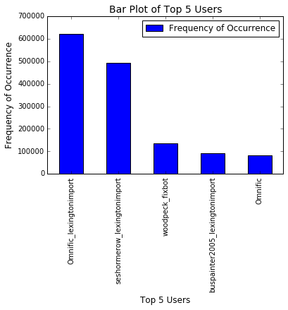
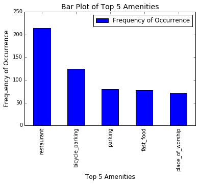
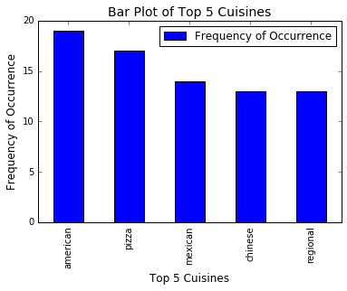
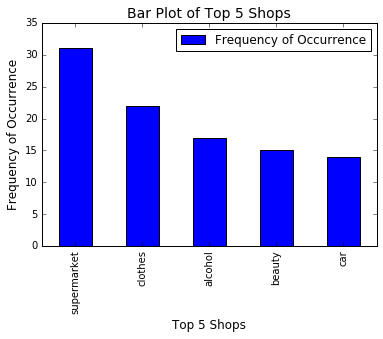
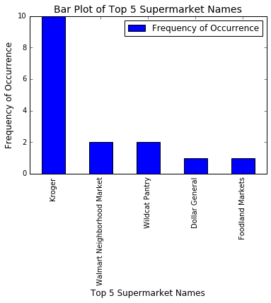
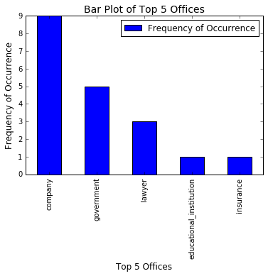

<center> <h1><b>Wrangle OpenStreetMap Data[SQL]</b></h1> </center>


## Introduction


For this report, I choose the OpenStreetMap data at https://www.openstreetmap.org/export#map=12/38.0498/-84.4589 for area around the city of Lexington, KY. The data file **lexington.osm** is in OSM XML format and 366.1 Mb in size. The data was auditied, cleaned and transformed into csv format and eventually added to a SQLite database for querying.

# Auditing The Data

The OpenStreetMap data is in XML format. The basic component of the OSM conceptual data model is an **Element**. Physical features like building, street etc are represented by these elements. Elements consist of **nodes**(a point in space), **ways**(open or closed line) and **relation**(how nodes and ways related to each other). The meaning of a particular element is described by one or more **tags** in the OSM XML file. Tags are described by key  e.g **k="addr:street"** and its value **v="Tates Creek Centre Drive"**. Below is an example of a node from lexington.osm file to illustrate the concepts described above:

~~~xml
    <node id="313098690" lat="37.9705618" lon="-84.4986918" version="5" timestamp="2017-03-09T19:50:22Z" changeset="46720180" uid="5456536" user="JudiciousJones">
                <tag k="addr:city" v="Lexington"/>
                <tag k="addr:housenumber" v="4101"/>
                <tag k="addr:postcode" v="40517"/>
                <tag k="addr:state" v="KY"/>
                <tag k="addr:street" v="Tates Creek Centre Drive"/>
                <tag k="landuse" v="commercial"/>
                <tag k="name" v="Kroger"/>
                <tag k="opening_hours" v="24/7"/>
                <tag k="shop" v="supermarket"/>
                <tag k="wheelchair" v="yes"/>
    </node>
~~~
**Iterative Parser** from the **Element Tree module** was used to parse through all the elements associated with each map feature at the start of the audit phase of the data wrangling process. The files used in this phase are **audit_*.py** where *=street, postcode, amenity, office etc

## Problems Encountered with the Data

The problems encountered with the data after running it through the data.py module were:
* Inconsistent street address abbreviations
* Inconsistent or incorrect zip codes
* Incorrect amenity type, shops names and office names

>### Inconsistent Street Type Abbreviations

>To search for street names, using file **audit_street.py**, I used a regular expression on the value of the tag with street address in it. Compared the street type to an eastablished list of street types. I made a dictionary, in the file, **maps.py** of the street types with key as the incorrect format of the street type and value as the correct format. Then using the function **update_address** in the program **data.py**, I corrected the street names. For example an incorrect street type format 'PKWY' was updated to 'Parkway', 'st' to 'street', 'av' to 'Avenue' etc.

>### Inconsistent Zip Codes
    
>A couple of types of problems with zip codes, I encountered were incorrect format and incorrect value. For both these problems, I made use of a dictionary, that I wrote, in the file **maps.py**. Using the **update_address** function in the file **data.py**, I updated the 9 digit zip code to a 5 digit zip code for data consistency and also corrected the incorrect zip code to a correct one using the street address asociated with that zip code.

>### Incorrect Amenity Type, Shops Names and Office Names
    
>The main issue in these categories was incorrect or too specific names. I used a standard list of names for the amenity, office and shop types from the OSM website and compared the data with those list and made corrections accordingly, using a similar methodology I mentioned in the above two sections.

## Database formation
Once the data was cleaned, next stage was transforming and inserting it to an **SQLite database** by iteratively parsing each top level element in the XML, using **shape_element** function, in **data.py** file, to shape elements into several data structures, using a **schema** in **schema.py** and validation library(cerebrus) class instance validator in **validate_element** function to ensure correct data format. An instance of the data structure for each element before transportation to csv files is as follows.
For nodes:
~~~python
{'node': {'id': 757860928,
          'user': 'uboot',
          'uid': 26299,
       'version': '2',
          'lat': 41.9747374,
          'lon': -87.6920102,
          'timestamp': '2010-07-22T16:16:51Z',
      'changeset': 5288876},
 'node_tags': [{'id': 757860928,
                'key': 'amenity',
                'value': 'fast_food',
                'type': 'regular'},
               {'id': 757860928,
                'key': 'cuisine',
                'value': 'sausage',
                'type': 'regular'},
               {'id': 757860928,
                'key': 'name',
                'value': "Shelly's Tasty Freeze",
                'type': 'regular'}]}
~~~                
and for ways:
~~~python
{'way': {'id': 209809850,
         'user': 'chicago-buildings',
         'uid': 674454,
         'version': '1',
         'timestamp': '2013-03-13T15:58:04Z',
         'changeset': 15353317},
 'way_nodes': [{'id': 209809850, 'node_id': 2199822281, 'position': 0},
               {'id': 209809850, 'node_id': 2199822390, 'position': 1},
               {'id': 209809850, 'node_id': 2199822392, 'position': 2},
               {'id': 209809850, 'node_id': 2199822369, 'position': 3},
               {'id': 209809850, 'node_id': 2199822370, 'position': 4},
               {'id': 209809850, 'node_id': 2199822284, 'position': 5},
               {'id': 209809850, 'node_id': 2199822281, 'position': 6}],
 'way_tags': [{'id': 209809850,
               'key': 'housenumber',
               'type': 'addr',
               'value': '1412'},
              {'id': 209809850,
               'key': 'street',
               'type': 'addr',
               'value': 'West Lexington St.'},
              {'id': 209809850,
               'key': 'street:name',
               'type': 'addr',
               'value': 'Lexington'},
              {'id': '209809850',
               'key': 'street:prefix',
               'type': 'addr',
               'value': 'West'},
              {'id': 209809850,
               'key': 'street:type',
               'type': 'addr',
               'value': 'Street'},
              {'id': 209809850,
               'key': 'building',
               'type': 'regular',
               'value': 'yes'},
              {'id': 209809850,
               'key': 'levels',
               'type': 'building',
               'value': '1'},
              {'id': 209809850,
               'key': 'building_id',
               'type': 'chicago',
               'value': '366409'}]}
~~~

After validation, the data is written into corresponding **csv files**.

In these csv files, the upper most line contains the keys from tags. These key names would become the column names in sql tables after generation of sql database.

In the csv files **nodes.csv** and **ways.csv**, these keys are:  
id,lat,lon,user,uid,version,changeset,timestamp

In the **nodes_tags.csv** and **ways_tags.csv** files, the keys are:  
id,key,value,type

In the **ways_nodes.csv** file, the keys are:  
id,node_id,position

The **MakeTable** function in the **database.py** file, takes two inputs. One input is an ordered dictionary whose keys are the column names to the table and whose values are the declaration in sql of the type of variable the column contains. The other input is a string that is the file name of the corresponding csv file that is input into the function and read and written to the table. 


## Querying the Data for Exploration
    
Once the SQLite database was ready, I was able to query it to explore for interesting facts about my city using the file **query.py**. In the query.py file, the functions **map_features** and **map_feature_details** take a map feature and map feature+sub_categories respectively and return an sql query regarding those inputs. These queries are then input into functions **number_of** which returns the most frequent number of occurence of an entity of interest and the function **list_of_top** which returns the top most frequent entities in the form of a list of lists. These list of lists can be input to function **print_in_pandas** to print out the top most frequent entities in the form of a pandas table. Below is an execution quries through the query.py file for exploration of the data.


```python
import pandas as pd
import numpy as np
import matplotlib.pyplot as plt
%matplotlib inline
from IPython.core.interactiveshell import InteractiveShell
InteractiveShell.ast_node_interactivity = "all"
import query
from query import * 


```


```python
# Function to plot the table
def plotfn(dataframe,str):
    df_plot=dataframe.plot.bar(align='center')
    categories=dataframe.ix[:,0]
    tick_spacing = np.array(range(len(categories)))
    df_plot.set_xlabel("Top 5 "+str, fontsize=12)
    df_plot.set_ylabel("Frequency of Occurrence", fontsize=12)
    df_plot.set_title("Bar Plot of Top 5 "+str,fontsize=14)
    plt.xticks(tick_spacing, categories)
    return
```


```python
# Top Contributing Users
print_in_pandas(list_of_top(contributing_users),'User')
plotfn(print_in_pandas(list_of_top(contributing_users),'User'),'Users')
```

    


<div>
<table border="1" class="dataframe">
  <thead>
    <tr style="text-align: right;">
      <th></th>
      <th>User</th>
      <th>Frequency of Occurrence</th>
    </tr>
  </thead>
  <tbody>
    <tr>
      <th>1</th>
      <td>Omnific_lexingtonimport</td>
      <td>620752</td>
    </tr>
    <tr>
      <th>2</th>
      <td>seshormerow_lexingtonimport</td>
      <td>493554</td>
    </tr>
    <tr>
      <th>3</th>
      <td>woodpeck_fixbot</td>
      <td>134711</td>
    </tr>
    <tr>
      <th>4</th>
      <td>buspainter2005_lexingtonimport</td>
      <td>91800</td>
    </tr>
    <tr>
      <th>5</th>
      <td>Omnific</td>
      <td>83320</td>
    </tr>
  </tbody>
</table>
</div>


    





```python
# Top Amenites
print_in_pandas(list_of_top(map_features('"amenity"')),'Amenity')
plotfn(print_in_pandas(list_of_top(map_features('"amenity"')),'Amenity'),'Amenities')
```

    


<div>
<table border="1" class="dataframe">
  <thead>
    <tr style="text-align: right;">
      <th></th>
      <th>Amenity</th>
      <th>Frequency of Occurrence</th>
    </tr>
  </thead>
  <tbody>
    <tr>
      <th>1</th>
      <td>restaurant</td>
      <td>214</td>
    </tr>
    <tr>
      <th>2</th>
      <td>bicycle_parking</td>
      <td>125</td>
    </tr>
    <tr>
      <th>3</th>
      <td>parking</td>
      <td>80</td>
    </tr>
    <tr>
      <th>4</th>
      <td>fast_food</td>
      <td>78</td>
    </tr>
    <tr>
      <th>5</th>
      <td>place_of_worship</td>
      <td>72</td>
    </tr>
  </tbody>
</table>
</div>


    





```python
# Top Religions
print_in_pandas(list_of_top(map_feature_details('"place_of_worship"','"religion"')),'Religion')
plotfn(print_in_pandas(list_of_top(map_feature_details('"place_of_worship"','"religion"')),'Religion'),'Religions')
```

    


<div>
<table border="1" class="dataframe">
  <thead>
    <tr style="text-align: right;">
      <th></th>
      <th>Religion</th>
      <th>Frequency of Occurrence</th>
    </tr>
  </thead>
  <tbody>
    <tr>
      <th>1</th>
      <td>christian</td>
      <td>67</td>
    </tr>
    <tr>
      <th>2</th>
      <td>unitarian_universalist</td>
      <td>1</td>
    </tr>
  </tbody>
</table>
</div>


    


```python
# Top Cuisines
print_in_pandas(list_of_top(map_feature_details('"restaurant"','"cuisine"')),'Cuisine')
plotfn(print_in_pandas(list_of_top(map_feature_details('"restaurant"','"cuisine"')),'Cuisine'),'Cuisines')
```

    


<div>
<table border="1" class="dataframe">
  <thead>
    <tr style="text-align: right;">
      <th></th>
      <th>Cuisine</th>
      <th>Frequency of Occurrence</th>
    </tr>
  </thead>
  <tbody>
    <tr>
      <th>1</th>
      <td>american</td>
      <td>19</td>
    </tr>
    <tr>
      <th>2</th>
      <td>pizza</td>
      <td>17</td>
    </tr>
    <tr>
      <th>3</th>
      <td>mexican</td>
      <td>14</td>
    </tr>
    <tr>
      <th>4</th>
      <td>chinese</td>
      <td>13</td>
    </tr>
    <tr>
      <th>5</th>
      <td>regional</td>
      <td>13</td>
    </tr>
  </tbody>
</table>
</div>


    





```python
# Top Shops
print_in_pandas(list_of_top(map_features('"shop"')),'shop')
plotfn(print_in_pandas(list_of_top(map_features('"shop"')),'Shop'),'Shops')
```

    


<div>
<table border="1" class="dataframe">
  <thead>
    <tr style="text-align: right;">
      <th></th>
      <th>shop</th>
      <th>Frequency of Occurrence</th>
    </tr>
  </thead>
  <tbody>
    <tr>
      <th>1</th>
      <td>supermarket</td>
      <td>31</td>
    </tr>
    <tr>
      <th>2</th>
      <td>clothes</td>
      <td>22</td>
    </tr>
    <tr>
      <th>3</th>
      <td>alcohol</td>
      <td>17</td>
    </tr>
    <tr>
      <th>4</th>
      <td>beauty</td>
      <td>15</td>
    </tr>
    <tr>
      <th>5</th>
      <td>car</td>
      <td>14</td>
    </tr>
  </tbody>
</table>
</div>


    





```python
# Top supermarkets
print_in_pandas(list_of_top(map_feature_details('"supermarket"','"name"')),'supermarket name')
plotfn(print_in_pandas(list_of_top(map_feature_details('"supermarket"','"name"')),'supermarket name'),
       'Supermarket Names')
```

    


<div>
<table border="1" class="dataframe">
  <thead>
    <tr style="text-align: right;">
      <th></th>
      <th>supermarket name</th>
      <th>Frequency of Occurrence</th>
    </tr>
  </thead>
  <tbody>
    <tr>
      <th>1</th>
      <td>Kroger</td>
      <td>10</td>
    </tr>
    <tr>
      <th>2</th>
      <td>Walmart Neighborhood Market</td>
      <td>2</td>
    </tr>
    <tr>
      <th>3</th>
      <td>Wildcat Pantry</td>
      <td>2</td>
    </tr>
    <tr>
      <th>4</th>
      <td>Dollar General</td>
      <td>1</td>
    </tr>
    <tr>
      <th>5</th>
      <td>Foodland Markets</td>
      <td>1</td>
    </tr>
  </tbody>
</table>
</div>


    





```python
# Top offices
print_in_pandas(list_of_top(map_features('"office"')),'Office')
plotfn(print_in_pandas(list_of_top(map_features('"office"')),'Office'),'Offices')
```

    


<div>
<table border="1" class="dataframe">
  <thead>
    <tr style="text-align: right;">
      <th></th>
      <th>Office</th>
      <th>Frequency of Occurrence</th>
    </tr>
  </thead>
  <tbody>
    <tr>
      <th>1</th>
      <td>company</td>
      <td>9</td>
    </tr>
    <tr>
      <th>2</th>
      <td>government</td>
      <td>5</td>
    </tr>
    <tr>
      <th>3</th>
      <td>lawyer</td>
      <td>3</td>
    </tr>
    <tr>
      <th>4</th>
      <td>educational_institution</td>
      <td>1</td>
    </tr>
    <tr>
      <th>5</th>
      <td>insurance</td>
      <td>1</td>
    </tr>
  </tbody>
</table>
</div>


    





```python
# Top Companies Names
print_in_pandas(list_of_top(map_feature_details('"company"','"name"')),'Company Name')
plotfn(print_in_pandas(list_of_top(map_feature_details('"company"','"name"')),'Company Name'),'Company Names')
```

    


<div>
<table border="1" class="dataframe">
  <thead>
    <tr style="text-align: right;">
      <th></th>
      <th>Company Name</th>
      <th>Frequency of Occurrence</th>
    </tr>
  </thead>
  <tbody>
    <tr>
      <th>1</th>
      <td>Counseling Associates</td>
      <td>1</td>
    </tr>
    <tr>
      <th>2</th>
      <td>Fayette Seed</td>
      <td>1</td>
    </tr>
    <tr>
      <th>3</th>
      <td>Foodchain</td>
      <td>1</td>
    </tr>
    <tr>
      <th>4</th>
      <td>Kamp Food Inc</td>
      <td>1</td>
    </tr>
    <tr>
      <th>5</th>
      <td>Kong Productions</td>
      <td>1</td>
    </tr>
  </tbody>
</table>
</div>


    


# Conclusion
There was a fair amount of inconsistency and incompleteness in the data. It might help if the contribution of users is run through an automatic check for consistency such as in street types etc before submission. And for completeness some kind of minimum field inputs requrement would help. 
OSM has a multitude of software components that renders a lot of fluidity in data entry and hence possibility of inconsistencies. Since OpenStreetMap is an open platform with an editing API, the choice of the editors remain in the hands of the contributors depending on the platform and simplicity of its use. A cross check program, just as an example like the ones I used for auditing data, could be built in the process to check for example against a standard street type, before sumission of data into database used by OSM. That would make the data more consistent, but it may not be easy to implement or could affect contribution from users in negative way since they may be less motivated to contribute in an environment that is more restrictive.
